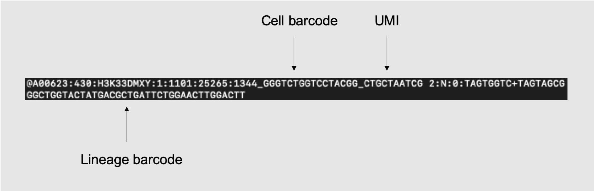
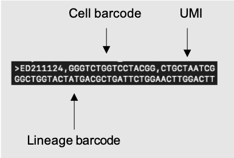

Data and code associated with the paper: 

*Single-cell delineation of lineage and genetic identity in the mouse brain.*

Rachel C. Bandler\#, Ilaria Vitali\#, Ryan N. Delgado\#, May C. Ho, Elena Dvoretskova, Josue S. Ibarra Molinas, Sophia Maedler, Paul Frazel, Maesoumeh Mohammadkhani, Robert Machold, Shane A. Liddelow, Tomasz J. Nowakowski, Gord Fishell, Christian Mayer\*

\# Equal contribution  
\* Corresponding authors

[Link to article](https://www.nature.com)

# TrackerSeq

TrackerSeq is a 10X Genomics compatible method that labels cells with a unique lineage barcode. This repository contains scripts that can take take raw FASTQ files and convert them into clonal annotations. The process is divided mainly into four steps: 

1. Pre-processing and barcode matching (**1_pre_process.sh**)
    * Input: Raw Read1 and Read2 files generated from next generation sequencing 
    * Output: 
      1. A fastq file with lineage barcode sequences and headers indicating cell barcode and UMI. 
      2. Cell barcode whitelist .txt file. 
2. Reformat (**2_reformat.ipynb**)
    * Input: The output of step 1 (fastq files of barcodes with headers indicating cell barcode and UMI)
        * 
    * Output:
        1. Reformmated FASTQ file that's LARRY compatible. 
            * 
        2. A library .txt where each row indicates dataset origin of the lineage barcode. If done correctly, each row should have the same dataset. 
3. Lineage Barcode identification (**3_LARRY_Kleinlab.ipynb**)
    * Input: 
         1. The reformatted FASTQ file that's been converted to a LARRY compatible format from step 2.
         2. Library .txt file generated from step 2.
         3. A .txt file where each row is a cellbc. You can use the whitelist generated in step 1 or get the cell barcodes from your Seurat object.
    * Output: 
         1. CSV file in the form of an NxM binary matrix, where entry (i,j) is 1 if cell i is in clone j
         2. Numpy version of the NxM binary matrix
         3. A barcode .txt file of all the collapsed lineage barcodes
4. Matrix trimming and cellbc assignment (**4_cellbc_assign.ipynb**)
    * Input:
        1. NxM binary matrix CSV file from step 3
        2. Numpy version of the NxM binary from step 3
        3. Cell barcode whitelist generated from step 1
    * Output:
        2. Trimmed matrix CSV file with cellbc column added
5. cloneID assignment (**5_lineage_assign.Rmd**)
    * Input: Trimmed matrix CSV file from step 4 with cellbc
    * Output: A CSV file containing the following columuns: cloneID, cellbc, and dataset

cloneID.umi6, where we had the UMI set at 6, was the output we chose from step 3 to input into step 4 to assign cloneIDs. 

### Barcode Diversity Estimation
A separate pipeline is used to analyze barcodes that are sequenced directly from the plasmid. For that, please see the markdown file, **barcode_diversity.md**, which contains scripts that are excuted in bash, python, and R. 

# Lineage Coupling Analysis
### Steps for Lineage Coupling Analysis:
1. Lineage Coupling Analysis input file generation (**1_generate_input_for_lineage_coupling_analysis_TIS2_refined_clus.R**)
    * Input:
        1. A seurat object, which can be downloaded from <seurat_obj_url>.
        2. Parameters of choice (hardcoded in the R file).
    * Output: CSV files with the following columns: num_cell, cellID, cloneID and identity_class. These files are grouped in subdirectories that indicate the data used to generate them, inside the "lb_pool" folder. Each of these files can be the input for the next step.
2. Lineage Coupling Analysis (**2_lineage_coupling_analysis_wagner_way_5.py**)
    * Input:
        1. A CSV file containing the following columns for each cell: "cloneID", "ident". The location of this file can be specified as a parameter when running the script.
        2. Other parameters of choice. For displaying an overview of the parameters run:
            `python **lineage_coupling_analysis_wagner_way_5.py --help**`
            For automating generation of commands see the corresponding cell in the Jupyter Notebook **3_Plot_heatmaps_and_other_helper_methods.ipynb**.
            Note that the file structure implied by the parameters is not created dynamically and must be created manually before running the script.
        The packages of the conda environment used to run this script can be found in file **Requirements.txt**.
    * Output:
        1. A CSV file with the z-score of each pair of classes.
        2. A CSV file with the lineage coupling (i.e. correlation) score of each pair of classes.
        3. A CSV file with the metric value described in the Methods section of the paper computed for each pair of classes.
        4. A CSV file with the number of shared clones of each pair of classes, as described in the Methods section of the paper.
        5. A CSV file with the number of cells that belonged to shared clones computed for each pair of classes, as described in the Methods section of the paper
        6. A pdf file with the plot of the z-scores.
        6. A pdf file with the plot of the lineage coupling (i.e. correlation) scores.
3. (**3_Plot_heatmaps_and_other_helper_methods.ipynb**)
    * Input:
        1. 
    * Output:
        1. 
        For outputing the heatmaps with annotations, see relevant cell in **Plot_heatmaps_and_other_helper_methods.ipynb**.

The packages of the conda environment used to run the Python script can be found in file **requirements.txt**

# STICR
This Or do you not think this is necessary?   is used to call STICR barcode/Cell Barcode (CBC) pairs sub-amplified from 10X genomics cDNA libraries. This uses the output from the [STICR barcode extraction script](https://github.com/NOW-Lab/STICR).

It first makes an index of all STICR barcodes present in the sample. Then, for each CBC, it calculates the relative abundances of each associated STICR barcode. If there is a single STICR barcode associated with a CBC, then that STICR barcode is assigned as the clone barcode. If there are multiple STICR barcodes, then the script will determine whether the most abundant of these STICR barcodes (by UMI count) can be called "Dominant" based on its relative abundance to the second-most abundant STICR barcode (by UMI count). The user may choose to change this threshold based on their own specific dataset, but in this analysis a stringent ratio of 5 was used. CBCs with a single associated STICR barcode are classified as Tier 1. CBCs that have multiple associated STICR barcodes, but one of which is determined to be “dominant” is classified as Tier 2. CBCs that lack a “dominant” barcode are classified as Tier 0. Users can define a UMI count minimum by updating the variable “UMI.cutoff”. This cutoff is applied after STICR/CBC barcode pairs are called and STICR barcodes with UMI counts lower than this threshold are removed. In our study, Tier 1 and a UMI.cutoff of 9 were used for the main analysis. Tier >=1 was used for the extended analysis of Amygdala, Olfactory Bulb and Striatum.  

The output for the first part of the script includes 3 files:
1) Barcodes.aligned; a vector of STICR barcodes present in each library 
2) Final.VBC.Index.df; a data.frame containing columns "VBC_Final","Type", and "Sequence". "Sequence" is the actual STICR barcode sequence while "VBC_Final" is the paired reference "key" number of that STICR barcode within the library (used for computation). "Type" refers to the type of clone in which the STICR barcode was found, with possible values: "Multiplet","MOI_1", and "SingleCellClone”. "MOI_1" refers to cells with a single STICR barcode. "SingleCellClone" refers to a dominant STICR barcode found in just a single cell. Cells that lack a "Dominant" STICR barcode are called "Multiplets" and have a VBC_Final of 0 in each library. Here, the term "Multiplets" does not necessarily mean that multiple cells were captured in the same droplet, but instead that multiple STICR barcodes were detected within the droplet, neither of which appears to be substantially more abundant than the other. 
3) Full.VBC.Single.ls.rds; a character vector with STICR barcodes recovered in the library

The second part of the script converts the Barcodes.aligned output into a final data.frame containing the:
1)	 CBC 
2)	 STICR Barcode UMI Count (“VBC_Count”)
3)	 Tier 
4)	 STICR barcode Sequence
5)	 UMI count of STICR Barcode 
6)	 Final.VBC.Call
7)	 Library

CBCs with a Tier 0 call are included in the final output, but lack a barcode assignment. 

